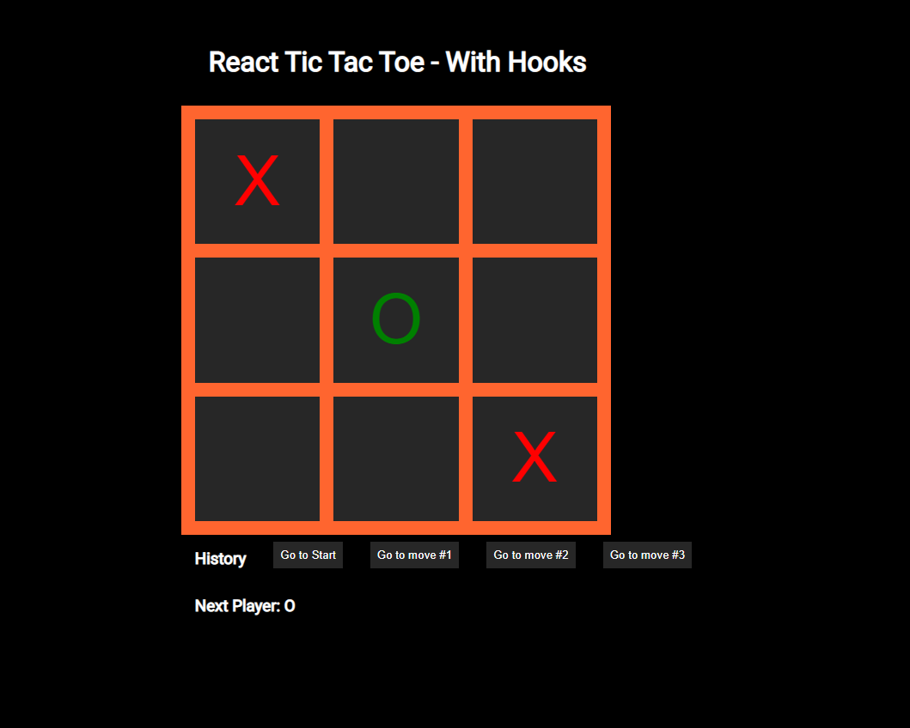

# React Todo List

## Overview

Deployed Application: https://ttc-react.herokuapp.com/
React tic tac toe game with hooks

## Table of Contents

- [Overview](#Overview)
- [Description](#Description)
- [Installation](#Installation)
- [Usage](#Usage)
- [License](#License)
- [Contributors](#Contributors)
- [GitHub](#GitHub)

## Description

Tic tac toe game with hooks using React

## Installation

    `npm install`

## Usage

To run app locally:

    `npm start`

Once 'App listening on PORT: 3000' displays in your terminal, open your browser and search:

    `http://localhost:3000/`

## License

[MIT License](http://opensource.org/licenses/mit-license.php)

## Github Info

[Dan Chiev](https://github.com/dchiev),
